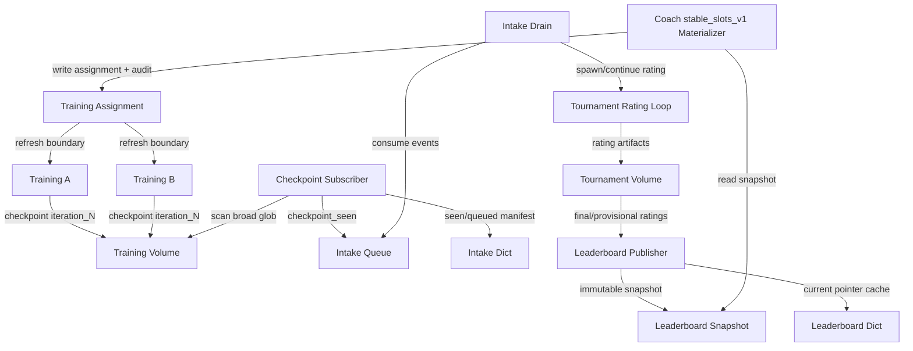

# Closed-Loop Leaderboard-To-Training Spec

Date: 2026-05-13

Current general contracts:

- `docs/working/training/curvytron_feedback_loop/POLICY_OBSERVATION_CONTRACT.md`
- `docs/working/training/curvytron_feedback_loop/OBSERVABILITY_CONTRACT.md`

## Plain Goal

Build a real closed loop:

1. Training runs write checkpoints.
2. A subscriber discovers new checkpoints.
3. The tournament/adaptive Elo system rates those checkpoints.
4. A public leaderboard snapshot exposes trusted opponent candidates.
5. A Coach materializer turns that snapshot into a small immutable training
   assignment.
6. Training runs periodically refresh their opponent assignment at safe
   boundaries.

This path is implemented and proven at canary scale in the active all-v2 lane.
It is not yet proven at production scale.

## Current Truth

Implemented:

- Training writes checkpoints to the runs Volume from
  `src/curvyzero/contracts/curvytron.py`, currently `curvyzero-runs-v2` for the
  active all-v2 lane.
- Tournament can discover checkpoints via `train/lightzero_exp*/ckpt`.
- Tournament intake has Modal Dict/Queue and scheduled tick/drain functions.
- Tournament ratings write Volume artifacts (`latest.json`, `ratings.json`,
  `pair_history.json`, `scheduler_state.json`).
- Trainer env supports opponent mixtures: frozen checkpoints, blank/no-op,
  fixed-straight, proactive wall-avoidant, and immortal opponent death mode.
- A pure assignment parser exists in `src/curvyzero/training/opponent_registry.py`.
- Public leaderboard snapshots, live pointer payloads, top-slot smoke
  assignments, and `stable_slots_v1` assignments can be built and validated in
  pure code.
- The tournament-side publisher has been remote-smoked: it writes public
  leaderboard snapshot/latest artifacts and updates the compact Dict pointer.
- The assignment artifact writer has been remote-smoked: it stores
  `assignment.json` and optional `audit.json` under a training attempt.
- The trainer and checkpoint eval/GIF poller can consume an explicit
  assignment ref and resolve it through the existing opponent-mixture contract.
- A current-code canary completed the live run-id loop: trainer checkpoints,
  live intake/subscriber discovery, tiny tournament rating, public leaderboard
  publish, immutable assignment materialization, control-pointer rewrite, same
  running trainer refresh, and provider-ok env telemetry rows.

Not yet proven at production scale or automated:

- Modal Dict pointer repair/fallback for public leaderboard snapshots. Local
  repair coverage, a tiny remote smoke, and a minimal operator runbook exist.
- Periodic safe assignment refresh during long production training.
- Online Elo continuation from existing `latest.json` at production scale.
  Local continuation coverage exists.
- Queue/dedupe repair from durable scans when Dict/Queue state is stale. Local
  repair coverage exists.
- One-frame public leaderboard validation at real scale. Local gating and a
  tiny two-checkpoint remote smoke exist.
- Automated end-to-end test from checkpoint emission to tournament promotion to
  trainer refresh at production scale.

Launch lifetime rule:

- Non-detached `modal run` is not a safe parent for background tournament
  game/rating workers after the local command exits.
- If an intake/drain command spawns child workers and should return before they
  finish, use `modal run --detach` or a deployed function that keeps the work
  alive correctly.
- Do not treat scheduling as success. Verify `latest.json` advanced and
  completed game summaries exist.

## Target Architecture



## Opponent Slots

Use a small number of named slots so training behavior is stable and auditable.
The exact count can be 3 or 5; design for `max_slots=5`.

| Slot | Purpose | Default source |
| --- | --- | --- |
| `champion` | strongest currently trusted policy | top active leaderboard row |
| `recent_strong` | newer high-performing policy | active/provisional recent row |
| `diverse_challenger` | non-near duplicate pressure | high-ranked outside same recipe/family |
| `anchor` | stable historical or median policy | curated anchor row |
| `sentinel` | simple diagnostic pressure | blank/no-op or scripted entry |

Training assignment should not expose "top 5" as a live query. It should expose:

```json
{
  "schema_id": "curvyzero_opponent_assignment/v0",
  "assignment_id": "run123-attempt001-refresh000",
  "source_epoch": 17,
  "source_ref": "tournaments/curvytron/leaderboards/main/snapshots/...",
  "seed": 12345,
  "entries": [
    {
      "name": "slot_champion",
      "weight": 20,
      "tags": ["slot:champion", "leaderboard"],
      "opponent_policy_kind": "frozen_lightzero_checkpoint",
      "opponent_checkpoint_ref": "training/.../iteration_270000.pth.tar"
    }
  ]
}
```

## Run-Scoped Slot Recipes

Operators should be able to change the desired slot recipe for a specific
training run after launch.

The recipe can live in Modal Dict:

```text
curvyzero-training-slot-recipes
run_slot_recipe:<training_run_id>
```

This Dict value is not training truth. It is mutable intent. A Coach
materializer reads the recipe, reads a verified public leaderboard snapshot,
then writes a new immutable `assignment.json`, `audit.json`, and refresh record
to the training Volume.

The trainer still consumes only assignment refs at safe boundaries. It should
not read this Dict during learner updates.

## Refresh Semantics

Do not refresh inside a single LightZero env step or learner update.

Allowed refresh boundaries:

- training launch;
- resume boundary;
- explicit operator-triggered refresh;
- optional checkpoint boundary if implemented as a controlled attempt-side event.

Recommended first implementation:

- assignment is created at launch;
- long-running training can write a **pending assignment** periodically;
- trainer only swaps assignment at a checkpoint boundary after writing current
  checkpoint and metadata;
- every refresh increments `refresh_index`.

## Subscriber Semantics

Subscriber owns checkpoint discovery, not training.

Inputs:

- active watch records in the intake Dict;
- broad checkpoint scan spec, usually run IDs or run prefixes;
- checkpoint Volume.

Output:

- durable intake manifest update on the tournament Volume;
- Queue events with stable ids;
- tick artifact.

Plain contract:

- A run-ID or run-prefix scan is a live watch. It can discover future
  checkpoints from the same training runs.
- An explicit checkpoint-ref list is a frozen seed. It does not discover future
  checkpoints.
- Discovery must use the broad LightZero checkpoint shape:
  `train/lightzero_exp*/ckpt/iteration_*.pth.tar`. Timestamped DI-engine
  folders are normal.
- The intake record is just the watch state: what to scan, what has been seen,
  and what has been queued. It is not a training manifest and it is not a
  leaderboard.
- Queue events are wakeups. The Volume manifest and rating artifacts are the
  truth.

Rules:

- A checkpoint can be discovered many times; only new refs should enqueue.
- `seen_checkpoint_refs` and `queued_checkpoint_refs` stay separate.
- Queue loss must be repairable by periodic scanning.
- Drain must claim a rating run before spawning work.
- If a rating run already exists, drain must reject unless continuation is
  explicit with `continue_from_latest=True`.
- `spawn_if_existing=True` is not enough by itself. It is only safe when paired
  with explicit continuation.
- Continuation must keep the full known checkpoint pool from
  `seen_checkpoint_refs`. A latest-only scan must not drop older checkpoints
  that were already rated.
- The active tournament pool defaults to the top 100 mature policies. Mature
  rows below that cutoff are marked `retired` and are not scheduled for future
  games. They are not deleted from rating history. New or under-tested rows stay
  `provisional` even if their temporary rank is below 100, because they still
  need placement games.

## Submit-Only Service Contract

The product-facing tournament contract should be:

```text
submit checkpoint/run candidates -> tournament service schedules/rates them
```

Normal callers should not pass:

- `pair_selection`;
- `pairs_per_round`;
- `games_per_pair`;
- GIF sampling settings;
- evaluator timing;
- MCTS/search settings;
- active-status thresholds.

Those values belong to the configured intake/service manifest. The operator can
set them when creating or replacing the service generation. Candidate submit
only appends exact checkpoint refs or run IDs.

Current shape:

- `intake-seed` is the admin/configure path. It creates the active watch record
  and captures scheduler/evaluator defaults.
- `tournament-submit` / `intake-submit` is the narrow candidate path. It accepts
  exact checkpoint refs, or run IDs to add to the service watch.
- Scheduled subscriber/drain reads the service manifest and uses the manifest's
  policy.

Critical caveat:

- The manifest generation is the policy unit. Changing scheduler or evaluator
  policy should create a new generation or be recorded explicitly; it must not
  silently change the meaning of an existing rating run.

## Tournament Semantics

Official rating runs must record:

- evaluator context hash;
- checkpoint roster hash;
- `decision_source_frames`;
- `decision_ms`;
- policy mode;
- model/env/reward variants;
- games, wins, losses, draws;
- distinct opponents;
- status (`provisional`, `active`, `retired`);
- failure/draw/timeout rates.

Default scheduling policy:

- keep full rating history in `latest.json`;
- schedule active top-pool rows and provisional/new entrants;
- do not schedule retired rows;
- publish retired rows as retired, not provisional;
- let the Coach-facing assignment materializer consume active rows only by
  default.

For the new one-frame training lane, official public leaderboard context must
use one-frame semantics. Old 12-frame tournaments are historical/legacy unless
explicitly bridged.

## Public Leaderboard Snapshot

The public training-facing leaderboard is not the website response and not live
Modal Dict state.

It is an immutable Volume JSON snapshot:

```text
tournaments/curvytron/leaderboards/<leaderboard_id>/snapshots/<snapshot_id>.json
```

Modal Dict stores only:

```text
current:<leaderboard_id> -> snapshot pointer and compact summary
```

The tournament job owns writing this snapshot and pointer. Coach owns deciding
whether the evidence is good enough, when to select a new assignment, and when
training may consume it.

The trainer never reads the Dict during learning. The Coach materializer may use
Dict as a cache, verifies the Volume snapshot, then writes a training
assignment.

## Selection Policy

The production path is `stable_slots_v1`, a Coach-owned materializer.

It reads one verified public leaderboard snapshot and writes one immutable
`assignment.json` plus `audit.json`. Assignment entries are the slots. The
trainer sees only the assignment file.

`slot_rules_v0` should not be the production direction. It was a useful pressure
test, but it is too close to a small policy language. Purge it from launch
guidance instead of adding more behavior around it.

`top_slots_v0` can remain as a smoke/default helper if useful, but it is not the
recommended production materializer.

Inputs:

- verified leaderboard snapshot;
- source snapshot ref and sha256;
- expected leaderboard id and rating context hash;
- materializer profile, usually 3 slots or 5 slots;
- previous assignment, if used for safe fallback.

Default slots:

| Slot | Source |
| --- | --- |
| `champion` | top trusted active checkpoint |
| `recent_strong` | trusted recent checkpoint, using `recency.latest_for_run` |
| `diverse_challenger` | trusted checkpoint from a different run when possible |
| `anchor` | optional stable older checkpoint |
| `sentinel` | optional blank or wall-avoidant immortal entry |

Rules:

- prefer `active` rows;
- allow provisional rows only with an explicit flag and audit reason;
- dedupe checkpoint slots by checkpoint id and checkpoint ref;
- fail clearly when a required slot cannot be filled;
- include sentinels only as labeled assignment entries;
- exclude incompatible evaluator contexts;
- exclude missing or mutable checkpoint refs;
- record every fallback in audit.

If refresh selection is unsafe, keep the previous assignment instead of writing a
surprising degraded assignment.

## Non-Neural And Invincible Opponents

Training mixtures can include non-neural entries today.
Tournament leaderboard cannot rate them as first-class players yet.

Near-term rule:

- official leaderboard is checkpoint-first;
- scripted/blank/passive entries can be appended by the Coach materializer as
  training pressure;
- invincible/death-immune variants are assignment/eval pressure tools, not
  ordinary leaderboard players.

If later rated in tournaments, non-neural policies need a general participant
contract with `participant_kind`, stable id, parameter hash, labels, and loader
dispatch.

## End-To-End Proof We Need

Minimal success story:

1. Start with one active intake manifest containing a small training run set.
2. Subscriber discovers new checkpoint refs.
3. Drain starts or continues a rating run.
4. Rating produces `latest.json`.
5. Publisher writes public leaderboard snapshot.
6. Coach materializer writes assignment with 3-5 slots.
7. Trainer launch consumes assignment.
8. Eval/GIF/status record assignment id and source snapshot.
9. A later checkpoint causes a new rating update and a new assignment at refresh
   boundary.

This has been demonstrated manually in tiny smokes, including the
`stable_slots_v1` materializer path. The stable-slot smoke proved the plumbing
but exposed a slot-quality bug: rating rows did not carry enough checkpoint
recency metadata, so `recent_strong` could mean "best remaining" rather than
"newest useful checkpoint." Local code/tests now preserve that metadata; repeat
the remote smoke before trusting automatic refresh. This is not yet automated
or production-ready.

## First Implementation Slice

Do not start with Modal end-to-end.

Start with pure code:

1. public leaderboard snapshot validator/builder from existing rating snapshot; **done**
2. `stable_slots_v1` materializer from snapshot to `assignment.json` +
   `audit.json`; **done locally**
3. tests for deterministic materialization and immutable refs; **done locally**

Then wire:

4. local materialization CLI writes snapshot/pointer/assignment/audit artifacts; **done**
5. publisher function writes snapshot and Dict pointer; **local test done**
6. assignment artifact writer stores assignment/audit under an attempt; **remote smoke done**
7. trainer CLI/payload threads `--opponent-assignment-ref` into the resolver; **local tests done**
8. Modal smoke proves assignment is used; **remote smoke done**

Then integrate:

9. subscriber/rating/publisher/materializer/trainer e2e smoke; **manual tiny smoke done with stable_slots_v1; repeat after recency metadata repair**

## Current Blocker

The conceptual blocker is not the leaderboard math or first trainer wiring.
Those have both been proven in small smoke paths.

Also, a perfect starting leaderboard is not required for bootstrap training.
Bootstrap runs may start from curated/static assignments with immortal
blank/hard-coded pressure and any exact frozen checkpoint refs. A stable,
coverage-mature leaderboard is only required before we let leaderboard-derived
top slots steer opponent quality heavily.

The remaining gate is making the loop safe to operate without handholding:
repair stale pointers, continue ratings without losing evidence, dedupe or
repair lost intake events, document the assignment writer path, and validate a
larger one-frame loop.

After the manual smoke, the current blocker is automation and safety:

```text
periodic refresh policy + online continuation + repair/idempotency + production runbook
```
# Closed Loop Spec

General current contracts now live at:

- `docs/working/training/curvytron_feedback_loop/POLICY_OBSERVATION_CONTRACT.md`
- `docs/working/training/curvytron_feedback_loop/OBSERVABILITY_CONTRACT.md`
