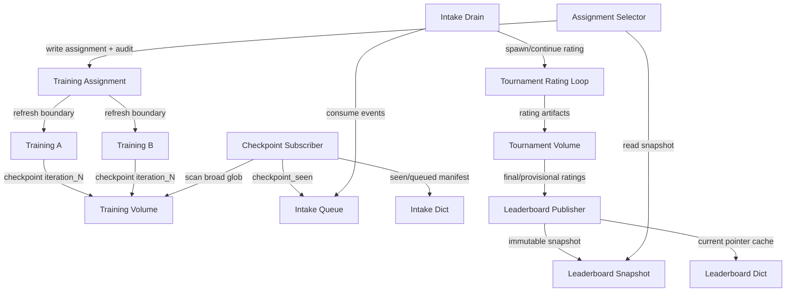

# Closed-Loop Leaderboard-To-Training Spec

Date: 2026-05-13

## Plain Goal

Build a real closed loop:

1. Training runs write checkpoints.
2. A subscriber discovers new checkpoints.
3. The tournament/adaptive Elo system rates those checkpoints.
4. A public leaderboard snapshot exposes trusted opponent candidates.
5. A selector turns that snapshot into a small immutable training assignment.
6. Training runs periodically refresh their opponent assignment at safe
   boundaries.

This is not fully implemented today.

## Current Truth

Implemented:

- Training writes checkpoints to `curvyzero-runs`.
- Tournament can discover checkpoints via `train/lightzero_exp*/ckpt`.
- Tournament intake has Modal Dict/Queue and scheduled tick/drain functions.
- Tournament ratings write Volume artifacts (`latest.json`, `ratings.json`,
  `pair_history.json`, `scheduler_state.json`).
- Trainer env supports opponent mixtures: frozen checkpoints, blank/no-op,
  fixed-straight, proactive wall-avoidant, and immortal opponent death mode.
- A pure assignment parser exists in `src/curvyzero/training/opponent_registry.py`.
- Public leaderboard snapshots, live pointer payloads, and top-slot assignments
  can be built and validated in pure code.
- The tournament-side publisher has been remote-smoked: it writes public
  leaderboard snapshot/latest artifacts and updates the compact Dict pointer.
- The assignment artifact writer has been remote-smoked: it stores
  `assignment.json` and optional `audit.json` under a training attempt.
- The trainer and checkpoint eval/GIF poller can consume an explicit
  assignment ref and resolve it through the existing opponent-mixture contract.
- A tiny manual closed-loop smoke completed: assignment-backed train smoke,
  checkpoint discovery/intake, tiny rating, public leaderboard publish, fresh
  assignment selection, and second assignment-backed train smoke.

Not yet implemented:

- Modal Dict pointer repair/fallback for public leaderboard snapshots.
- Periodic safe assignment refresh during long training.
- Online Elo continuation from existing `latest.json` at production scale.
- Queue/dedupe repair from durable scans when Dict/Queue state is stale.
- One-frame public leaderboard validation at real scale.
- Automated end-to-end test from checkpoint emission to tournament promotion to
  trainer refresh.

## Target Architecture



## Opponent Slots

Use a small number of named slots so training behavior is stable and auditable.
The exact count can be 3 or 5; design for `max_slots=5`.

| Slot | Purpose | Default source |
| --- | --- | --- |
| `champion` | strongest currently trusted policy | top active leaderboard row |
| `recent_strong` | newer high-performing policy | active/provisional recent row |
| `diverse_challenger` | non-near duplicate pressure | high-ranked outside same recipe/family |
| `anchor` | stable historical or median policy | curated anchor row |
| `sentinel` | simple diagnostic pressure | blank/no-op or scripted entry |

Training assignment should not expose "top 5" as a live query. It should expose:

```json
{
  "schema_id": "curvyzero_opponent_assignment/v0",
  "assignment_id": "run123-attempt001-refresh000",
  "source_epoch": 17,
  "source_ref": "tournaments/curvytron/leaderboards/main/snapshots/...",
  "seed": 12345,
  "entries": [
    {
      "name": "slot_champion",
      "weight": 20,
      "tags": ["slot:champion", "leaderboard"],
      "opponent_policy_kind": "frozen_lightzero_checkpoint",
      "opponent_checkpoint_ref": "training/.../iteration_270000.pth.tar"
    }
  ]
}
```

## Refresh Semantics

Do not refresh inside a single LightZero env step or learner update.

Allowed refresh boundaries:

- training launch;
- resume boundary;
- explicit operator-triggered refresh;
- optional checkpoint boundary if implemented as a controlled attempt-side event.

Recommended first implementation:

- assignment is created at launch;
- long-running training can write a **pending assignment** periodically;
- trainer only swaps assignment at a checkpoint boundary after writing current
  checkpoint and metadata;
- every refresh increments `refresh_index`.

## Subscriber Semantics

Subscriber owns checkpoint discovery, not training.

Inputs:

- active watch records in the intake Dict;
- broad checkpoint scan spec, usually run IDs or run prefixes;
- checkpoint Volume.

Output:

- durable intake manifest update on the tournament Volume;
- Queue events with stable ids;
- tick artifact.

Plain contract:

- A run-ID or run-prefix scan is a live watch. It can discover future
  checkpoints from the same training runs.
- An explicit checkpoint-ref list is a frozen seed. It does not discover future
  checkpoints.
- The intake record is just the watch state: what to scan, what has been seen,
  and what has been queued. It is not a training manifest and it is not a
  leaderboard.
- Queue events are wakeups. The Volume manifest and rating artifacts are the
  truth.

Rules:

- A checkpoint can be discovered many times; only new refs should enqueue.
- `seen_checkpoint_refs` and `queued_checkpoint_refs` stay separate.
- Queue loss must be repairable by periodic scanning.
- Drain must claim a rating run before spawning work.
- If rating run already exists, either reject or explicitly continue from
  `latest.json`. No silent reset.
- Continuation must keep the full known checkpoint pool. A latest-only scan
  must not drop older checkpoints that were already rated.

## Tournament Semantics

Official rating runs must record:

- evaluator context hash;
- checkpoint roster hash;
- `decision_source_frames`;
- `decision_ms`;
- policy mode;
- model/env/reward variants;
- games, wins, losses, draws;
- distinct opponents;
- status (`provisional`, `active`, `retired`);
- failure/draw/timeout rates.

For the new one-frame training lane, official public leaderboard context must
use one-frame semantics. Old 12-frame tournaments are historical/legacy unless
explicitly bridged.

## Public Leaderboard Snapshot

The public training-facing leaderboard is not the website response and not live
Modal Dict state.

It is an immutable Volume JSON snapshot:

```text
tournaments/curvytron/leaderboards/<leaderboard_id>/snapshots/<snapshot_id>.json
```

Modal Dict stores only:

```text
current:<leaderboard_id> -> snapshot pointer and compact summary
```

The trainer never reads the Dict during learning. The selector may use Dict as a
cache, verifies the Volume snapshot, then writes a training assignment.

## Selection Policy

Current code implements only `top_slots_v0`.

What `top_slots_v0` actually does:

- picks the top active row as `champion`;
- picks the next eligible row as `recent_strong`;
- tries to pick a different run for `diverse_challenger`;
- picks a middle-ish ranked row as `anchor`;
- optionally adds a blank/no-op sentinel;
- does not yet enforce recipe/family diversity or evaluator-context filtering
  beyond what the snapshot already contains.

The rules below are the intended product rules. Some are not implemented yet.

Inputs:

- verified leaderboard snapshot;
- previous assignment, if any;
- training run lineage;
- selector seed;
- desired slots.

Rules:

- prefer `active` rows;
- allow `recent_provisional` only with explicit strategy flag;
- avoid all slots coming from the same run/family/recipe; **partially
  implemented as different-run preference only**
- include at least one stable anchor; **currently middle-ranked row, not curated**
- include sentinels only as labeled entries;
- exclude incompatible evaluator contexts; **not yet enforced by selector**
- exclude missing or mutable checkpoint refs;
- record every fallback in audit; **basic audit exists, richer fallback detail is
  still TODO**

## Non-Neural And Invincible Opponents

Training mixtures can include non-neural entries today.
Tournament leaderboard cannot rate them as first-class players yet.

Near-term rule:

- official leaderboard is checkpoint-first;
- scripted/blank/passive entries can be appended by assignment selector as
  training pressure;
- invincible/death-immune variants are assignment/eval pressure tools, not
  ordinary leaderboard players.

If later rated in tournaments, non-neural policies need a general participant
contract with `participant_kind`, stable id, parameter hash, labels, and loader
dispatch.

## End-To-End Proof We Need

Minimal success story:

1. Start with one active intake manifest containing a small training run set.
2. Subscriber discovers new checkpoint refs.
3. Drain starts or continues a rating run.
4. Rating produces `latest.json`.
5. Publisher writes public leaderboard snapshot.
6. Selector writes assignment with 3-5 slots.
7. Trainer launch consumes assignment.
8. Eval/GIF/status record assignment id and source snapshot.
9. A later checkpoint causes a new rating update and a new assignment at refresh
   boundary.

This has now been demonstrated manually in a tiny smoke. It is not yet automated
or production-ready.

## First Implementation Slice

Do not start with Modal end-to-end.

Start with pure code:

1. public leaderboard snapshot validator/builder from existing rating snapshot; **done**
2. assignment selector from snapshot to `assignment.json` + `audit.json`; **done**
3. tests for deterministic slot selection and immutable refs; **done**

Then wire:

4. local materialization CLI writes snapshot/pointer/assignment/audit artifacts; **done**
5. publisher function writes snapshot and Dict pointer; **local test done**
6. assignment artifact writer stores assignment/audit under an attempt; **remote smoke done**
7. trainer CLI/payload threads `--opponent-assignment-ref` into the resolver; **local tests done**
8. Modal smoke proves assignment is used; **remote smoke done**

Then integrate:

9. subscriber/rating/publisher/selector/trainer e2e smoke; **manual tiny smoke done**

## Current Blocker

The conceptual blocker is not the leaderboard math or first trainer wiring.
Those have both been proven in small smoke paths.

The remaining gate is making the loop safe to operate without handholding:
repair stale pointers, continue ratings without losing evidence, dedupe or
repair lost intake events, document the assignment writer path, and validate a
larger one-frame loop.

After the manual smoke, the current blocker is automation and safety:

```text
periodic refresh policy + online continuation + repair/idempotency + production runbook
```
