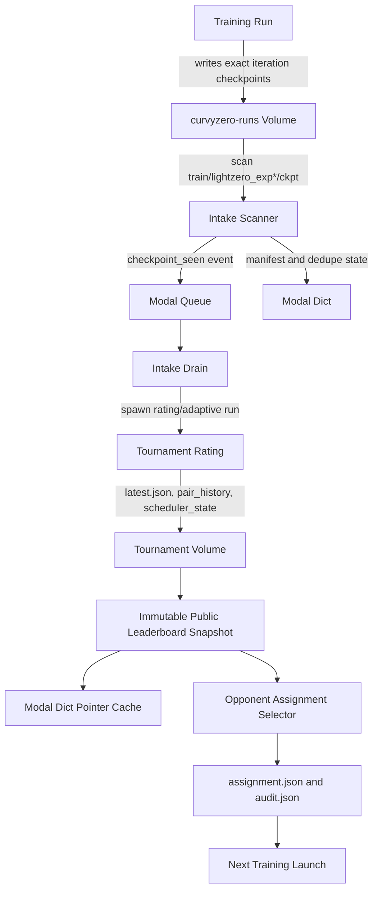

# End-To-End Dataflow

## Intended Flow



## Durable Truth

| Artifact | Durable? | Owner |
| --- | --- | --- |
| Training checkpoints | Yes | Training Volume |
| Intake manifest artifact | Yes | Tournament Volume |
| Rating snapshots | Yes | Tournament Volume |
| Public leaderboard snapshot | Should be yes | Tournament publisher |
| Assignment snapshot | Yes | Training attempt |
| Modal Dict pointer | No, cache only | Publisher/selector |
| Modal Queue event | No, coordination only | Intake scanner/drain |

## Writer And Reader Responsibilities

| Component | Writes | Reads | Must not do |
| --- | --- | --- | --- |
| Trainer | checkpoints, training artifacts | assignment snapshot | poll live leaderboard |
| Intake scanner | intake manifest, Queue events | checkpoint Volume | rank policies |
| Tournament reducer | rating snapshots | checkpoint refs, battle summaries | write training assignments |
| Public leaderboard publisher | immutable leaderboard snapshots, Dict pointer | rating snapshots | select per-run opponents |
| Assignment selector | `assignment.json`, `audit.json` | leaderboard snapshot | mutate ratings |
| Trainer launch wrapper | attempt metadata | assignment snapshot | rank/sample live |

## Current Implemented Flow

```text
checkpoint Volume -> intake manifest/Queue -> rating loop -> latest.json -> website/API
```

## Missing Flow

```text
latest.json -> public leaderboard snapshot -> assignment selector -> trainer launch
```

That missing flow is the core implementation target after documentation and
contract tests.
